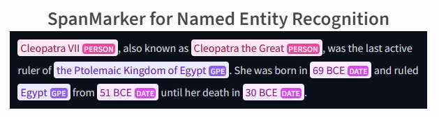

# Contributing Guidelines for vectara-cli

Thank you for your interest in contributing to `vectara-cli`! As an open-source project, we welcome contributions from developers of all skill levels. This guide will provide you with information on how to contribute effectively and make a valuable impact on the project.

## Prerequisites

Before you begin, ensure you have the following installed:

- Python (preferably the latest Python 3 version)
- Conda (for managing environments)
- Git (for version control)

## Identify An Issue

Browse the [Issues](https://git.tonic-ai.com/contribute/vectara/vectara-cli/issues) to find tasks to work on. You can start with issues labeled as "good first issue".
- If you have an idea or a bug fix that is not listed, feel free to open a new issue to discuss it with other contributors.

## Setting Up for Contribution

1. **Fork the Repository**: Visit [vectara-cli on GitLab](https://git.tonic-ai.com/contribute/vectara/vectara-cli/) and fork the project to your account.

2. **Create a New Branch**: Before you start making changes, switch to the `devbranch` and create a new branch for your feature or fix. We encourage naming your branch in a way that reflects the issue or feature you're working on.

    ```
    git checkout devbranch
    git checkout -b feature/your-feature-name
    ```
    Or, if you're working on a specific issue:

    ```
    git checkout devbranch
    git checkout -b issue/ISSUE_NUMBER-short-description
    ```

    This naming convention (`feature/your-feature-name` or `issue/ISSUE_NUMBER-short-description`) helps in identifying branches with their purposes, making collaboration and review processes more efficient.

- the easiest way to make a correctly named branch is to use the gitlab gui directly inside the issue that you are responding to.




3. **Create and Activate Conda Environment**:

   ```bash
   conda env create -f environment.yml
   conda activate vectara-cli
   ```

4. **Install the Project in Editable Mode**:

   ```bash
   pip install --editable .
   ```

## Develop

- **Add Functionality**: Write your code and add it to the appropriate directory:
  - For new functionalities, add your code in `./vectara_cli/commands`.
  - Add command line functionality in `main.py`.
  - Create or modify data objects in `./vectara_cli/data`.

- **Add Help Text**: Update help texts in `./vectara_cli/help_texts/help_text.py` to reflect your changes or new commands.

## Write Tests

- Add tests for your new functionalities in the `tests/` directory.
- Ensure all tests pass by running them locally.

## Document Your Changes

Update any documentation relevant to your changes, including inline comments and README if necessary.

## Submitting Your Contributions

1. **Commit Your Changes**: After making your changes, commit them to your branch. Use descriptive commit messages that explain the "why" and "what" of your changes. This practice helps reviewers understand your reasoning and the context of your contributions.

    ```
    git add .
    git commit -m "A descriptive message explaining the change"
    ```

2. **Push Your Changes**: Once you're ready, push your changes to your forked repository on GitLab.

    ```
    git push origin feature/your-feature-name
    ```
    Or, if you're working on an issue:

    ```
    git push origin issue/ISSUE_NUMBER-short-description
    ```

### 3. Create a Merge Request
- Go to the [Merge Requests](https://git.tonic-ai.com/contribute/vectara/vectara-cli/-/merge_requests) page.
- Create a new merge request, compare your feature branch to the main repository's `devbranch`.
- Fill in a detailed description of your changes and link to any relevant issues.

## Review Process
Once your merge request is submitted:
- The project maintainers will review your code and may request changes.
- Collaborate on modifications and push updates to your branch accordingly.
- Once approved, a maintainer will merge your changes into the main codebase.

## Post-merge
After your changes have been merged:
- Sync your fork with the original repository.
- Consider deleting your branch to keep your fork clean:
  ```bash
  git branch -d your-feature-branch
  git push origin --delete your-feature-branch
  ```

Thank you for contributing to `vectara-cli`! For any questions or further discussions, please reach out on the issues page or [on discord](https://discord.gg/7H4SKQekKe).