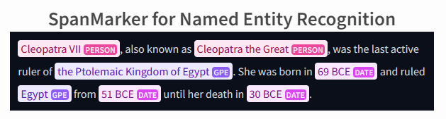

# vectara-cli

`vectara-cli` is a Python package designed to interact with the Vectara platform, providing a command-line interface (CLI) and a set of APIs for indexing and querying documents, managing corpora, and performing advanced text analysis and processing tasks. This package is particularly useful for developers and data scientists working on search and information retrieval applications.

## Features

- Indexing text and documents into Vectara corpora.
- Querying indexed documents.
- Creating and deleting corpora.
- Advanced text processing and analysis using pre-trained models (optional advanced package).

## Installation

### Basic Installation

The basic installation includes the core functionality for interacting with the Vectara platform.

```bash
pip install vectara-cli
```

### Advanced Installation

The advanced installation includes additional dependencies for advanced text processing and analysis features. This requires PyTorch, Transformers, and Accelerate, which can be substantial in size.

```bash
pip install vectara-cli[advanced]
```

Ensure you have an appropriate PyTorch version installed for your system, especially if you're installing on a machine with GPU support. Refer to the [official PyTorch installation guide](https://pytorch.org/get-started/locally/) for more details.

## Usage


### Basic Usage

#### Setting Up a Vectara Client

First, initialize the Vectara client with your customer ID and API key. This client will be used for all subsequent operations.

```python
from vectara_cli.core import VectaraClient

customer_id = 'your_customer_id'
api_key = 'your_api_key'
vectara_client = VectaraClient(customer_id, api_key)
```

#### Indexing a Document

To index a document, you need its corpus ID, a unique document ID, and the text you want to index. Optionally, you can include context, metadata in JSON format, and custom dimensions.

```python
corpus_id = 'your_corpus_id'
document_id = 'unique_document_id'
text = 'This is the document text you want to index.'
context = 'Document context'
metadata_json = '{"author": "John Doe"}'

vectara_client.index_text(corpus_id, document_id, text, context, metadata_json)
```

#### Indexing Documents from a Folder

To index all documents from a specified folder into a corpus, provide the corpus ID and the folder path.

```python
corpus_id = 'your_corpus_id'
folder_path = '/path/to/your/documents'

results = vectara_client.index_documents_from_folder(corpus_id, folder_path)
for document_id, success, extracted_text in results:
    if success:
        print(f"Successfully indexed document {document_id}.")
    else:
        print(f"Failed to index document {document_id}.")
```

#### Querying Documents

To query documents, specify your search query, the number of results you want to return, and the corpus ID.

```python
query_text = 'search query'
num_results = 10  # Number of results to return
corpus_id = 'your_corpus_id'

results = vectara_client.query(query_text, num_results, corpus_id)
print(results)
```

#### Creating a Corpus

You can create a new corpus by specifying its ID, name, description, and other settings.

```python
create_corpus_response = vectara_client.create_corpus(
    corpus_id=123456789,
    name="Example Corpus",
    description="This is an example corpus.",
    dtProvision=1234567890,
    enabled=True,
    swapQenc=False,
    swapIenc=False,
    textless=False,
    encrypted=False,
    encoderId="default",
    metadataMaxBytes=10000,
    customDimensions=[
        {"name": "dimension1", "description": "First custom dimension", "servingDefault": 1.0, "indexingDefault": 1.0}
    ],
    filterAttributes=[
        {"name": "filter1", "description": "First filter attribute", "indexed": True, "type": "FILTER_ATTRIBUTE_TYPE__UNDEFINED", "level": "FILTER_ATTRIBUTE_LEVEL__UNDEFINED"}
    ]
)
print(create_corpus_response)
```

#### Deleting a Corpus

To delete a corpus, you only need to provide its ID.

```python
corpus_id = 'your_corpus_id'
response, success = vectara_client.delete_corpus(corpus_id)

if success:
    print("Corpus deleted successfully.")
else:
    print("Failed to delete corpus:", response)
```

#### Uploading a Document

To upload and index a document, specify the corpus ID, the path to the document, and optionally, a document ID and metadata.

```python
corpus_id = 'your_corpus_id'
file_path = '/path/to/your/document.pdf'
document_id = 'unique_document_id'  # Optional
metadata = {"author": "Author Name", "title": "Document Title"}  # Optional

try:
    response, status = vectara_client.upload_document(corpus_id, file_path, document_id, metadata)
    print("Upload successful:", response)
except Exception as e:
    print("Upload failed:", str(e))
```

### Advanced Useage


To leverage the advanced text processing capabilities, ensure you have completed the advanced installation of `vectara-cli`. This includes the necessary dependencies for text analysis:

```bash
pip install vectara-cli[advanced]
```


### Commercial Advanced Useage

The advanced features allow you to enrich your indexes with additional information automatically. This should produce better results for retrieval.


### Non-Commercial Advanced Usage

The advanced features allow you to enrich your indexes with additional information automatically. This should produce better results for retrieval.




### Non-Commercial Advanced Usage Using Span Models

The `vectara-cli` package extends its functionality through the advanced usage of Span Models, enabling users to perform sophisticated text analysis and entity recognition tasks. This feature is particularly beneficial for non-commercial applications that require deep understanding and processing of textual data.

The `Span` class supports processing and indexing documents from a folder, enabling batch operations for efficiency. This feature allows for the automatic extraction of entities from multiple documents, which are then indexed into specified corpora with enriched metadata.


#### Features

- **Named Entity Recognition (NER)**: Utilize pre-trained Span Models to identify and extract entities from text, enriching your document indexes with valuable metadata.
- **Model Flexibility**: Choose from a variety of pre-trained models tailored to your specific needs, including `fewnerdsuperfine`, `multinerd`, and `largeontonote`.
- **Enhanced Document Indexing**: Improve search relevance and results by indexing documents enriched with named entity information.

#### Usage

1. **Initialize Vectara Client**: Start by creating a Vectara client instance with your customer ID and API key.

    ```python
    from vectara_cli.core import VectaraClient

    customer_id = 'your_customer_id'
    api_key = 'your_api_key'
    vectara_client = VectaraClient(customer_id, api_key)
    ```

2. **Load and Use Span Models**: The `Span` class facilitates the loading of pre-trained models and the analysis of text to extract entities.

    ```python
    from vectara_cli.advanced.nerdspan import Span

    # Initialize the Span class
    span = Span(customer_id, api_key)

    # Load a pre-trained model
    model_name = "multinerd"  # Example model
    model_type = "span_marker"
    span.load_model(model_name, model_type)

    # Analyze text to extract entities
    text = "Your text here."
    output_str, key_value_pairs = span.analyze_text(model_name)
    print(output_str)
    ```

3. **Index Enhanced Documents**: After extracting entities, use the `VectaraClient` to index the enhanced documents into your corpus.

    ```python
    corpus_id = 'your_corpus_id'
    document_id = 'unique_document_id'
    metadata_json = json.dumps({"entities": key_value_pairs})

    vectara_client.index_text(corpus_id, document_id, text, metadata_json=metadata_json)
    ```

**Reference:** Aarsen, T. (2023). SpanMarker for Named Entity Recognition. Radboud University. Supervised by Prof. Dr. Fermin Moscoso del Prado Martin (fermin.moscoso-del-prado@ru.nl) and Dr. Daniel Vila Suero (daniel@argilla.io). Second assessor: Dr. Harrie Oosterhuis (harrie.oosterhuis@ru.nl).

#### Non-Commercial Advanced Rag Using Rebel


The mRebel pre-trained model is able to extract triplets for up to 400 relation types from Wikidata.


Use the use the `Rebel Class` for advanced indexing. This will automatically extract `named entities`, `key phrases`, and other relevant information from your documents : 


```python
from vectara_cli.advanced.non_commercial.rebel import Rebel

folder_path = '/path/to/your/documents'
query_text = 'search query'
num_results = 10  # Number of results to return
# Initialize the Rebel instance for advanced non-commercial text processing
rebel = Rebel()

# Perform advanced indexing
corpus_id_1, corpus_id_2 = rebel.advanced_upsert_folder(vectara_client, corpus_id_1, corpus_id_2, folder_path)

# Vanilla Retrieval 
plain_results = vectara_client.query(query_text, num_results, corpus_id_1)
# Enhanced Retrieval
enhanced_results = vectara_client.query(query_text, num_results, corpus_id_2)

# Print Results
print("=== Plain Results ===")
for result in plain_results:
    print(f"Document ID: {result['documentIndex']}, Score: {result['score']}, Text: {result['text'][:100]}...")

print("\n=== Enhanced Results ===")
for result in enhanced_results:
    print(f"Document ID: {result['documentIndex']}, Score: {result['score']}, Text: {result['text'][:100]}...")
```

## Contributing

Contributions to `vectara-cli` are welcome! Please refer to the contributing guidelines in the repository for more information on how to contribute.

## License

`vectara-cli` is MIT licensed. See the [LICENSE](LICENSE.md) file for more details.

---

This README provides a comprehensive guide for installing and using the `vectara-cli` package. For further information or assistance, please refer to the [Vectara documentation](https://docs.vectara.com) or submit an issue on the GitHub repository.